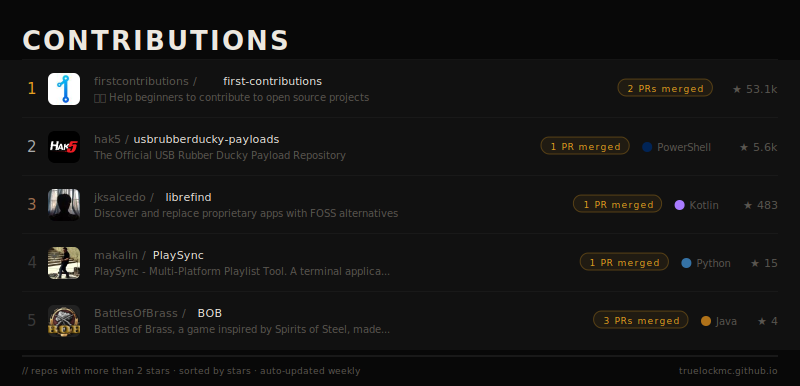

# 💫 About Me:
👋 Hi, I’m @truelockmc      👀 I’m interested in Cyber Security, Nature, Photography      🌱 I’m currently learning Homelab stuff      📫 How to reach me: anonyson@proton.me      😄 Pronouns: he/him     💬 A very cool Discord Server: https://discord.com/invite/wDESTYeZy9    📟 My website/portfolio: https://truelockmc.github.io / https://truelockmc.codeberg.page  

## 🌐 Socials:

 

# 💻 Tech Stack:
             
# 📊 GitHub Stats:
 

### 🔝 Top Contributed Repo

---

<picture>
  <source media="(prefers-color-scheme: dark)" srcset="https://raw.githubusercontent.com/truelockmc/truelockmc/output/github-snake-dark.svg" />
  <source media="(prefers-color-scheme: light)" srcset="https://raw.githubusercontent.com/truelockmc/truelockmc/output/github-snake.svg" />
  
</picture>

---
